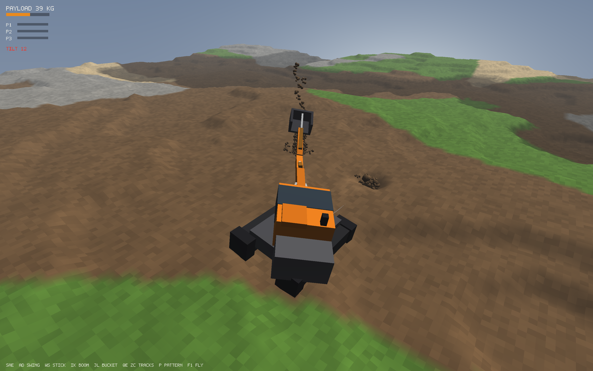

# GRAVEMASKIN

**The dirt is real. The machine is real. Your problems are entirely self-inflicted.**

Gravemaskin is an excavator simulator where the soil is a physical material, not
a texture with a hole-punch tool. Every bucket of dirt you tear out of the
ground exists — it has mass, it spills, it piles, it slumps to its angle of
repose, and if you cut a trench wall too steep in the wrong soil, it will wait
until you park next to it and then collapse onto your tracks.

## The machine fights back

There is no "dig" button. You operate hydraulic cylinders through real ISO or
SAE dual-stick controls, and the cylinders produce forces — nothing more.
Everything else is consequence:

- Load the bucket heavy at full reach and the boom **can't lift it**. Curl the
  stick in and suddenly it can. That's not a mechanic. That's leverage.
- Run three functions at once and they all slow down, because you're sharing
  one pump. Real operators feel this. Now you will too.
- Bury the bucket in compacted clay and the hydraulics stall against the
  relief valves while the engine grinds.
- Curl the bucket against the ground and the machine lifts **itself**.
- Swing a full bucket fast over the side with the tracks perpendicular, and
  the physics engine will quietly tip 1.7 tonnes of Norwegian engineering onto
  its cab. No canned animation. It just falls over, because you made it.

## Dirt with opinions

Sand runs back into your hole. Wet clay sticks to everything and stands in
proud vertical walls — until vibration finds them. Gravel is heavy, loose, and
disloyal. Buried rocks announce themselves mid-stroke with a **CLANK** that
stops the bucket dead, and then you have a little engineering problem: pry it,
roll it, drag it, or discover via the payload readout that this particular
pebble weighs 7.8 tonnes.

Every kilogram is accounted for. Dig it, spill it, pile it, drive over it,
compact it into ruts — the ground remembers.

## Honest machinery

- Machines modeled from real spec sheets: a 1.7-tonne mini excavator and a
  22-tonne tracked excavator, each with its published breakout forces, pump
  flows, and relief pressures — and the breakout forces aren't typed in, they
  *emerge* from bore diameters, relief valves, and linkage geometry.
- A fixed 60 Hz deterministic simulation — record a dig, replay the disaster.
- Fully procedural: every mesh, material, glyph, and sound generated in code.
  The download is small; the holes are large.
- Written in F#. Yes, the excavator game is functional-first. The dirt is the
  only thing allowed to be filthy.

Also: trench walls that collapse when you cut them too steep in the wrong
soil, tracks that compact loose spoil into ruts, dual-stick ISO/SAE controls
(keyboard or gamepad), a diesel that labors when the pumps do, and a save
format that accounts for every kilogram before it lets you quit.

## Status

Playable sandbox, built in the open. macOS, Windows, and Linux.
`just run` starts it; F1 toggles a free camera with a terrain-sculpting
brush; F5/F9 save and load; `--machine 320` brings the big iron.

Developer things live in [`SPEC.md`](SPEC.md) (the phased plan) and
[`docs/research/`](docs/research/) (the engineering research behind the soil
and hydraulics models). `just --list` shows the build commands.
